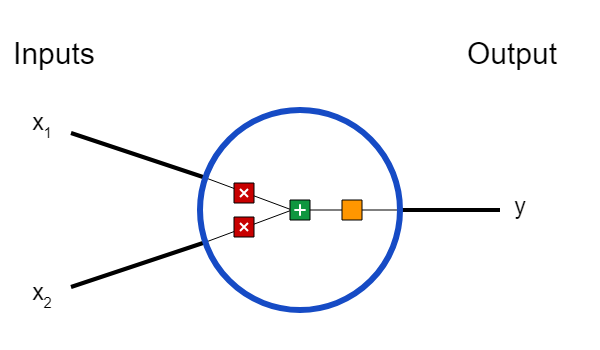
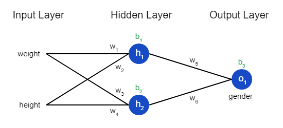
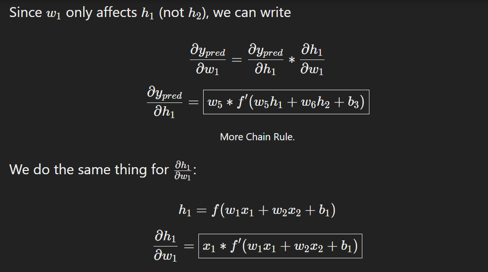
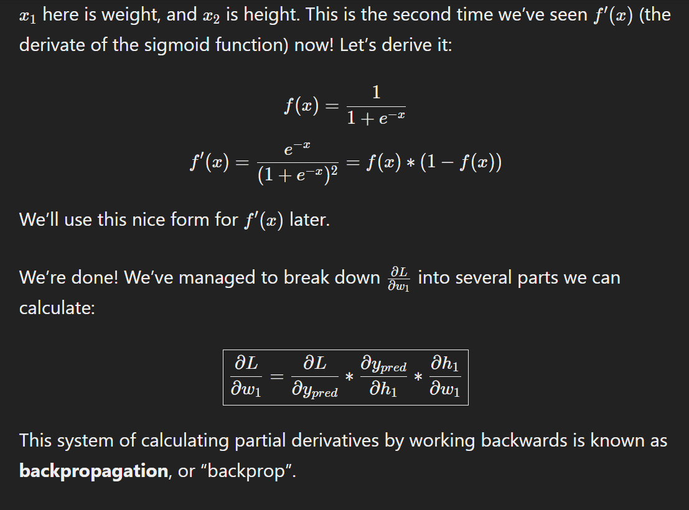

I have created a simple neural network using mnist data set from scratch just to understand it better

1) Building blocks: Neurons
- take in 2 inputs,does some computation adn gives output.

  inputs:
  
- 3 steps for that:~

1. each input is multipied by weights:~

          x1→x1∗w1
          𝑥2→𝑥2∗𝑤2

2.all the weights are added together bias b:~
          
          
          (x1∗w1)+(x2∗w2)+b
*(Simply put, bias is a constant term addded to the function to offset the result.Result can be seen when activation function is used, to shift the model toward +ve or -ve.)
 
3.Finally,the sum is passed through an activation function:
          
          y=f(x1*w1+x2*w2+b)
The activation function is used to turn an unbounded input into an output that has a nice, predictable form. A commonly used activation function is the sigmoid function:

sigmoid

The sigmoid function only outputs numbers in the range 
(
0
,
1
)
(0,1). You can think of it as compressing 
(
−
∞
,
+
∞
)
(−∞,+∞) to 
(
0
,
1
)
(0,1) - big negative numbers become ~
0
0, and big positive numbers become ~
1
1.

2)Combining neurons: 

a neural network is nothing more than a bunch of neurons connected together.

This network has 2 inputs, a hidden layer with 2 neurons (
ℎ
1
h 
1
​
  and 
ℎ
2
h 
2
​
 ), and an output layer with 1 neuron (
𝑜
1
o 
1
​
 ). Notice that the inputs for 
𝑜
1
o 
1
​
  are the outputs from 
ℎ
1
h 
1
​
  and 
ℎ
2
h 
2
​
  - that’s what makes this a network.

A hidden layer is any layer between the input (first) layer and output (last) layer. There can be multiple hidden layers!

An Example: Feedforward
Let’s use the network pictured above and assume all neurons have the same weights 𝑤=[0,1]w=[0,1], the same bias 𝑏=0
b=0, and the same sigmoid activation function. Let 
ℎ1,ℎ2,𝑜1h1,h2​,o1
​
  denote the outputs of the neurons they represent.

What happens if we pass in the input 
𝑥=[2,3]
x=[2,3]?

ℎ1=ℎ2=𝑓(𝑤⋅𝑥+𝑏)=𝑓((0∗2)+(1∗3)+0)=𝑓(3)=0.9526
h1=h2
​
 
​
  
=f(w⋅x+b)
=f((0∗2)+(1∗3)+0)
=f(3)
=0.9526
​
 
𝑜1=𝑓(𝑤⋅[ℎ1,ℎ2]+𝑏)=𝑓((0∗h1)+(1∗ℎ2)+0)=f(0.9526)=0.7216
o1=f(w⋅[h1,h2]+b)=f((0∗h1)+(1∗h2)+0)=f(0.9526)= 0.7216
​
 
​
 
The output of the neural network for input 
𝑥=[2,3]
x=[2,3] is 
0.7216
0.7216

3. Training a Neural Network, Part 1
Say we have the following measurements:

Name	Weight (kg)	Height (in)	Gender
Ani	80	70	M
Blud	71	65	F
orry	64	60	M
sanz	74	72	F

We’ll represent Male with a 
0
 and Female with a 
1, and we’ll also shift the data to make it easier to use:

Name	Weight (minus 61.29)	Height (minus 66)	Gender
Ani	  18.71	4	0

Blud	9.71	-1	1

orry	2.71	-6	0

Diana	12.71	6	1

I arbitrarily chose the shift amounts (
135
135 and 
66
66) to make the numbers look nice. Normally, you’d shift by the mean.

Loss
Before we train our network, we first need a way to quantify how “good” it’s doing so that it can try to do “better”. That’s what the loss is.

We’ll use the mean squared error (MSE) loss:MSE=1𝑛∑𝑖=1𝑛(𝑦𝑡𝑟𝑢𝑒−𝑦𝑝𝑟𝑒𝑑)^2

MSE= n1i=1∑n​(ytrue−ypred)^2
 
Let’s break this down:

𝑛

n is the number of samples, which is 
4

𝑦

y represents the variable being predicted, which is Gender.

𝑦𝑡𝑟𝑢𝑒

ytrue is the true value of the variable (the “correct answer”). For example, 

𝑦
𝑝
𝑟
𝑒
𝑑

ypred is the predicted value of the variable. It’s whatever our network outputs.
(
𝑦
𝑡
𝑟
𝑢
𝑒
−
𝑦
𝑝
𝑟
𝑒
𝑑
)
2
(y 
true
​
 −y 
pred
​
 ) 
2
  is known as the squared error. Our loss function is simply taking the average over all squared errors (hence the name mean squared error). The better our predictions are, the lower our loss will be!

Better predictions = Lower loss.

Training a network = trying to minimize its loss.

An Example Loss Calculation
Let’s say our network always outputs 
0
0 - in other words, it’s confident all humans are Male 🤔. What would our loss be?

Name	
𝑦
𝑡
𝑟
𝑢
𝑒
y 
true
​
 	
𝑦
𝑝
𝑟
𝑒
𝑑
y 
pred
​
 	
(
𝑦
𝑡
𝑟
𝑢
𝑒
−
𝑦
𝑝
𝑟
𝑒
𝑑
)
2
(y 
true
​
 −y 
pred
​
 ) 
2
 
Ani	0	0	0

Blud	1	0	1

orry	0	0	0

sanz	1	0	1

MSE=14(1+0+0+1)=
0.5

MSE= 41(1+0+0+1)= 
0.5

​4. Training a Neural Network, Part 2
We now have a clear goal:

 minimize the loss of the neural network. We know we can change the network’s weights and biases to influence its predictions, but how do we do so in a way that decreases loss?

This section uses a bit of multivariable calculus. If you’re not comfortable with calculus, feel free to skip over the math parts.

For simplicity, let’s pretend we only have Ani in our dataset:

Name	Weight (minus 135)	Height (minus 66)	Gender
Ani	18.71	4	0
Then the mean squared error loss is just Ani’s squared error:

MSE=11∑𝑖=11(𝑦𝑡𝑟𝑢𝑒−𝑦𝑝𝑟𝑒𝑑)2=(𝑦𝑡𝑟𝑢𝑒−𝑦𝑝𝑟𝑒𝑑)2=(1−𝑦𝑝𝑟𝑒𝑑)2

MSE= 11​i=1∑1(ytrue−y pred) 2=(y true−y pred) 2=(1−y pred) 2
 
​
 
Another way to think about loss is as a function of weights and biases. Let’s label each weight and bias in our network:

Then, we can write loss as a multivariable function:

Training: Stochastic Gradient Descent
We have all the tools we need to train a neural network now! We’ll use an optimization algorithm called stochastic gradient descent (SGD) that tells us how to change our weights and biases to minimize loss. It’s basically just this update equation:

𝑤
1
←
𝑤
1
−
𝜂
∂
𝐿
∂
​
 
𝜂
η is a constant called the learning rate that controls how fast we train. All we’re doing is subtracting 
𝜂
∂
𝐿
∂
𝑤
1
η 
∂w 
1
​
 
∂L
​

  from 
𝑤
1
w 
1
​
 :

If 
∂
𝐿
∂
𝑤
1
∂w 
1
​
 
∂L
​

  is positive, 
𝑤
1
w 
1
​
  will decrease, which makes 
𝐿
L decrease.
If 
∂
𝐿
∂
𝑤
1
∂w 
1
​
 
∂L
​
  is negative, 
𝑤
1
w 
1
​
  will increase, which makes 
𝐿
L decrease.
If we do this for every weight and bias in the network, the loss will slowly decrease and our network will improve.

Our training process will look like this:

Choose one sample from our dataset. This is what makes it stochastic gradient descent - we only operate on one sample at a time.
Calculate all the partial derivatives of loss with respect to weights or biases (e.g. 
∂
𝐿
∂
𝑤
1
∂w 
1
​
 
∂L
​
 , 
∂
𝐿
∂
𝑤
2
∂w 
2
​
 
∂L
​
 , etc).
Use the update equation to update each weight and bias.
Go back to step 1.

